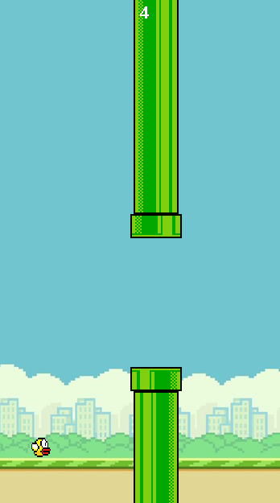

# Flappy Bird Java

<p align="center">
  
</p>

Implementação do Flappy Bird em Java 17 utilizando Swing e AWT, explorando game loop, renderização gráfica, física básica, detecção de colisões e programação orientada a objetos.

---

## Tecnologias


---

## Funcionalidades

* Controle do pássaro através da tecla Espaço
* Sistema de gravidade e movimentação vertical
* Geração automática de obstáculos
* Detecção de colisões entre pássaro e canos
* Sistema de pontuação
* Reinício da partida após Game Over

---

## Estrutura do Projeto

```text
src/
└── main/
    ├── java/
    │   └── org/
    │       └── example/
    │           ├── Main.java
    │           └── FlappyBird.java
    │
    └── resources/
        └── assets/
            ├── flappybird.png
            ├── flappybirdbg.png
            ├── toppipe.png
            └── bottompipe.png
```

---

## Como Executar

### Pré-requisitos

* Java 17 ou superior
* Maven 3.9 ou superior

Verifique as versões instaladas:

```bash
java --version
mvn --version
```

### Clonar o projeto

```bash
git clone https://github.com/AntonioSena0/FlappyBird.git
cd FlappyBird
```

### Executar o jogo

```bash
mvn exec:java
```

O Maven irá compilar o projeto e iniciar a aplicação utilizando a classe principal configurada no `pom.xml`.

### Gerar o pacote da aplicação

```bash
mvn clean package
```

---

## Controles

| Tecla                 | Ação                |
| --------------------- | ------------------- |
| Espaço                | Faz o pássaro subir |
| Espaço após Game Over | Reinicia a partida  |

## Conceitos Aplicados

* Programação Orientada a Objetos (POO)
* Classes internas
* Game Loop utilizando `javax.swing.Timer`
* Renderização gráfica com `Graphics`
* Manipulação de imagens com `ImageIcon`
* Eventos de teclado com `KeyListener`
* Detecção de colisão AABB (Axis-Aligned Bounding Box)
* Estruturas de dados com `ArrayList`
* Gerenciamento de estado do jogo

---

## Mecânicas do Jogo

### Física

O pássaro sofre a ação constante da gravidade, aumentando gradualmente sua velocidade vertical. Ao pressionar a tecla Espaço, uma força ascendente é aplicada, permitindo controlar a altura do personagem.

### Obstáculos

Os canos são gerados periodicamente em posições aleatórias, criando diferentes desafios a cada partida.

### Pontuação

A pontuação aumenta sempre que o pássaro atravessa com sucesso um conjunto de canos.

### Game Over

O jogo termina quando:

* O pássaro colide com um cano;
* O pássaro ultrapassa o limite inferior da tela.

Após o término da partida, basta pressionar Espaço para reiniciar.

---

## Licença

Este projeto foi desenvolvido para fins educacionais e de aprendizado em Java.
